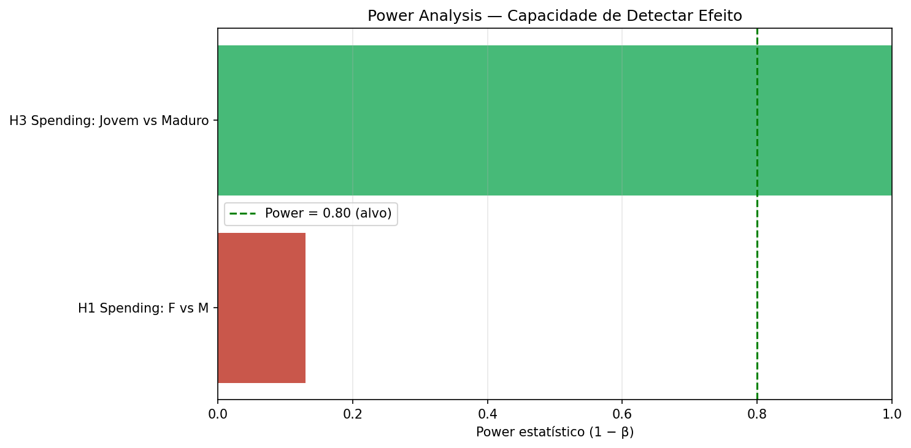
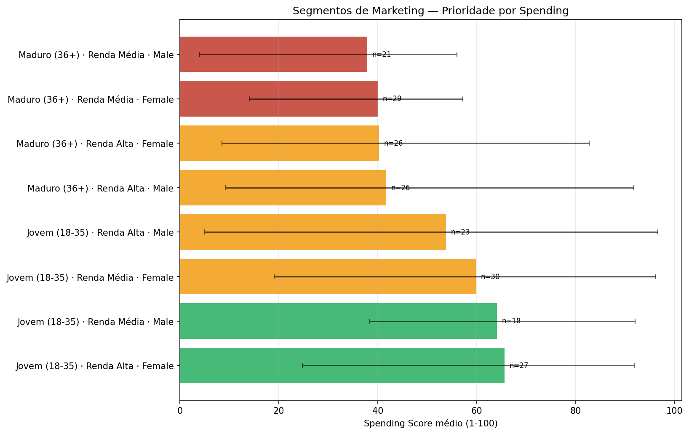

# Marketing Strategy — Decisão CMO Mall Customers

## Sumário Executivo

- **Clientes analisados:** 200
- **Spending médio:** 50.2/100
- **Idade significativa para Spending:** Sim (Kruskal-Wallis p < 0.001)
- **Gênero não é fator significativo** (p > 0.40)
- **Segmentos prioritários (ALTA):** 2

---

## 1. Power Analysis — Capacidade Detectiva

| Hipótese | n1 | n2 | Cohen's d | Magnitude | Power | n Necessário |
|---|---|---|---|---|---|---|
| H1 Spending: F vs M | 112 | 88 | 0.117 | Negligível | 0.13 | 1154 |
| H3 Spending: Jovem vs Maduro | 98 | 102 | 0.874 | Grande | 1.00 | 21 |

## 2. Segmentos de Marketing

| Idade | Renda | Gênero | n | Spending | IC 90% | Prioridade |
|---|---|---|---|---|---|---|
| Jovem (18-35) | Renda Alta | Female | 27 | 65.6 | [25, 92] | ALTA |
| Jovem (18-35) | Renda Média | Male | 18 | 64.1 | [38, 92] | ALTA |
| Jovem (18-35) | Renda Média | Female | 30 | 59.8 | [19, 96] | MEDIA |
| Jovem (18-35) | Renda Alta | Male | 23 | 53.8 | [5, 97] | MEDIA |
| Maduro (36+) | Renda Alta | Male | 26 | 41.7 | [9, 92] | MEDIA |
| Maduro (36+) | Renda Alta | Female | 26 | 40.2 | [8, 83] | MEDIA |
| Maduro (36+) | Renda Média | Female | 29 | 40.0 | [14, 57] | BAIXA |
| Maduro (36+) | Renda Média | Male | 21 | 37.9 | [4, 56] | BAIXA |

## 3. Alocação Sugerida de Budget Q1 (R$ 500k)

| Segmento | Spending | n | Alocação |
|---|---|---|---|
| Jovem (18-35) · Renda Alta · Female | 65.6 | 27 | R$ 88.2k |
| Jovem (18-35) · Renda Média · Male | 64.1 | 18 | R$ 57.4k |
| Jovem (18-35) · Renda Média · Female | 59.8 | 30 | R$ 89.3k |
| Jovem (18-35) · Renda Alta · Male | 53.8 | 23 | R$ 61.6k |
| Maduro (36+) · Renda Alta · Male | 41.7 | 26 | R$ 54.0k |
| Maduro (36+) · Renda Alta · Female | 40.2 | 26 | R$ 52.1k |
| Maduro (36+) · Renda Média · Female | 40.0 | 29 | R$ 57.8k |
| Maduro (36+) · Renda Média · Male | 37.9 | 21 | R$ 39.6k |

---

## Metodologia

- **Mann-Whitney U**: comparação de medianas para 2 grupos (não paramétrico).
- **Kruskal-Wallis**: extensão para 3+ grupos.
- **Cohen's d**: tamanho de efeito padronizado.
- **Power = 1 − β**: P(rejeitar H0 | H1 verdadeira). Alvo: ≥ 0.80.
- **Bootstrap 95% CI**: 10.000 reamostragens.
- **Alocação de budget**: proporcional a spending_medio × n por segmento.